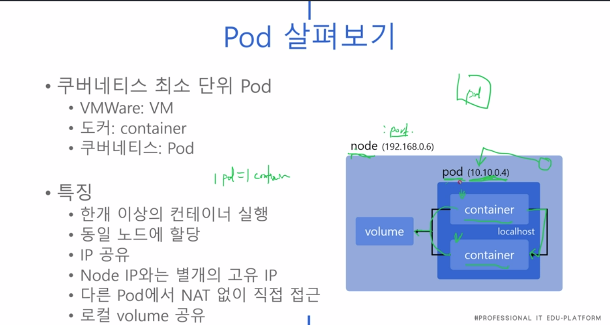

### 240120

Kubernetes 기초 강의 (2)

1. 내 k8s가 정상동작인지 확인
> kubectl cluster-info

What is Pod?

 > docker는 container가 최소단위, k8s에선 Pod가 최소단위임.

 - 1 pod = 1 container (보통) 실행, 

 - 동일 노드에 할당되며, IP 공유한다.

 - 

2. 앱 정의서를 Pod에 적용 : kubectl apply -f mynginx.yaml

3. 

4. 라벨링 시스템을 통해, 특정 노드에 나의 파드를 배치시킬 수 있음
  - kubectl label node master disktype=ssd

5. k8s엔 Volume이라는 저장소 개념이 있다. 이 역시도 yaml 파일에 정의됨.

[my-volume.yaml]
```
apiVersion: v1
kind: Pod
metadata:
  name: mynginx
spec:
  containers:
  - name: mynginx
    image: nginx
    volumeMounts:
    - mountPath: /test-volume
      name: my-volume
    volumes:
    - name: my-volume
      hostPath:
        path: /home
        type: Directory
```

#### Pod 개념 계속 보기..
